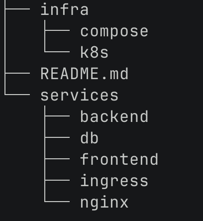

# cloud_computing_2025

## Student Technology Mapping

Developer: Eugen Ganscha

Application: Public notes platform

Image: debian/ubuntu

Programming Language: php

Database Platform: redis

## Project Overview

|  | The project is structured into two main blocks. |
|---|---|

## Starting the Application via Kubernetes

Follow these steps to start and test the Sakura-Notes application via Kubernetes:

0. **Expected Operating System: Linux or macOS**

    The following instructions explain how to properly set up the application for either Linux or macOS.

1. **Navigate to the scripts folder:**

   `cd infra/k8s/scripts`

2. **Run the start script to start minikube with the required addons and the application with the desired load-balancer:**

   Run `./start.sh ingress`

   To launch the application with ingress as a Load-Balancer

   OR Run `./start.sh nginx`

   To launch the application with an nginx container to handle the load-balancing in a similar way the application does when running via docker-compose.

   The script will launch minikube with all the required addons for the desired mode (assuming minikube is not already running).
   It will subsequently start to build and deploy the application with the selected load-balancer.

3. **[If using ingress as a Load-Balancer] - Run sudo minikube tunnel:**

    Run `sudo minikube tunnel` in a separate terminal

    This will ensure that the application can reach the website if you're using ingress.

4. **[If using ingress as a Load-Balancer] - Add sakura.notes to /etc/hosts:**
    
    Add the following line to `/etc/hosts`
    
    `127.0.0.1  sakura.notes`
    
    This will ensure that the sakura.notes website is properly reachable using ingress.

5. **Connect to the application via http:**

    Navigate to `http://sakura.notes` in your browser if you're using ingress. You will be re-directed to the https:// version of the website.
    (Adjust the ingress.yaml file, if you would like to change this behavior for some reason.)
    
    Navigate to `http://localhost:8000` in your browser if you're using nginx.

6. **Connect to the application via https:**

    Navigate to `https://sakura.notes` in your browser if you're using ingress.
    
    Navigate to `https://localhost:8001` in your browser.

    (The certificates are self-signed, you will receive a warning about establishing an insecure connection).

7. **[If using ingress as a Load-Balancer] - Press Ctrl + C in the minikube tunnel terminal and proceed to step 8.:**
    
    This will ensure that the minikube tunnel terminates correctly.

8. **Run the shutdown.sh script to delete the sakura-notes kubernetes namespace and stop minikube:**

    Run `./shutdown.sh`
    
    This deletes the sakura-notes kubernetes namespace, and then runs minikube stop.

## Starting the Application via docker-compose:

Follow these steps to start and test the Sakura-Notes application via docker-compose:

0. **Expected Operating System: Linux or macOS**

    The following instructions explain how to properly set up the application for either Linux or macOS.

1. **Navigate to the compose folder:**

   `cd infra/compose`

2. **Run docker-compose up -d inside the infra/compose folder:**

    Run `docker-compose up -d`

    This will launch the application via docker-compose. For load-balancing nginx will be used.

3. **Connect to the application via http:**

    Navigate to `http://localhost:8000` in your browser if you're using nginx.

4. **Connect to the application via https:**

    Navigate to `https://localhost:8001` in your browser.

5. **Run docker-compose down inside the infra/compose folder:**

    Run `docker-compose down`

    This will shut-down the application via docker-compose.